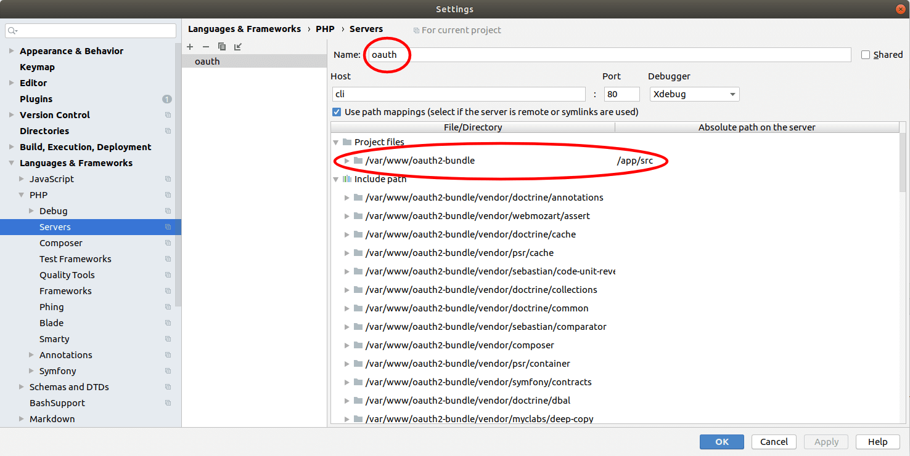

# Debugging

Before you start you'll need to setup your IDE, the following is an example in PhpStorm:



Then all you need to do is run the following command:

```sh
dev/bin/php-debug vendor/bin/phpunit
```

If you wish to use a different server name, you can do this with the
`PHP_IDE_CONFIG` env variable:

```sh
PHP_IDE_CONFIG=some_other_name dev/bin/php-debug vendor/bin/phpunit
```
